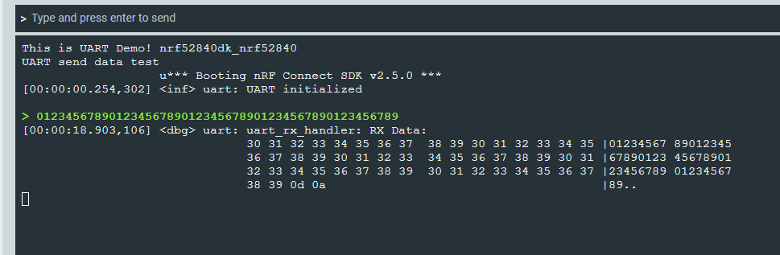

## 简介
这是一个在NCS下实现UART数据发送和接收的demo，其中数据接收通过中断方式实现，接收到数据会通过LOG方式回传；
## 步骤
* 新建一个“Hello World"的demo
* 在prj.conf中添加必要的配置
  ```
    CONFIG_LOG=y

    CONFIG_UART_NRFX=y
    CONFIG_UART_INTERRUPT_DRIVEN=y
  ```
* 在main.c中添加必要的头文件
  ```
    #include <zephyr/device.h>
    #include <zephyr/drivers/uart.h>
    #include <zephyr/logging/log.h>
  ```
* 注册LOG模块用于输出接收到的数据
  ```
  LOG_MODULE_REGISTER(uart, LOG_LEVEL_DBG);
  ```
* 定义用于储存UART接收数据的结构体
  ```
    #define UART_BUF_SIZE 256			// uart rx buffer size
    static struct uart_rx_buf
    {
        uint8_t buffer[UART_BUF_SIZE];
        uint8_t pointer;
    };

    static struct uart_rx_buf rx_buf = {
        .pointer = 0,
    };

  ```
* 在main()中添加UART初始化函数
  ```
  uart_init();
  ```
* 补充uart_init()的实现
  ```
    int uart_init(void)
    {
        const struct device *uart_dev = DEVICE_DT_GET(DT_NODELABEL(uart0));
        if(!uart_dev)
        {
            LOG_ERR("Cannot find uart\n");
            return -1;
        }

        uart_irq_callback_set(uart_dev, uart_rx_handler);
        uart_irq_rx_enable(uart_dev);

        LOG_INF("UART initialized\n");

        return 0;
    }
  ```
  初始化代码中，设置了rx中断的回调函数uart_rx_handler，并且使能了rx的中断；
  
  到此完成了UART的rx配置；

* 在main()中添加UART发送函数
  ```
  int main(void)
    {
        //...
        uart_send("UART send data test\n", sizeof("UART send data test\r\n"));
        //...
    }
  ```
  在上面代码中，实现了一个字符串的发送；
* 补充UART的TX发送函数实现
  ```
  int uart_send(uint8_t *data, uint16_t len)
    {
        const struct device *uart_dev = DEVICE_DT_GET(DT_NODELABEL(uart0));
        if(!uart_dev)
        {
            LOG_ERR("Cannot find uart\n");
            return -1;
        }

        for(uint16_t i = 0; i < len; i++)
        {
            uart_poll_out(uart_dev, data[i]);
        }
        return 0;
    }
  ```
  到处，完成了UART的TX功能实现；
* 编译并烧录程序，通过串口调试工具连接设备后，设备会打样“UART send data test\n”，向设备发送数据，设备会将接收到的数据LOG回来，如下图所示：


