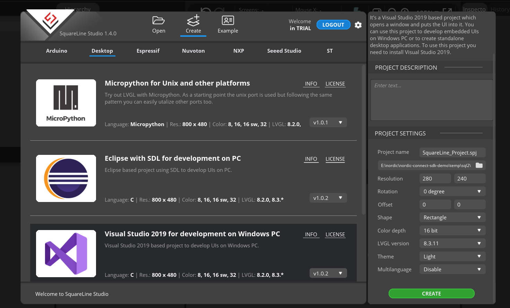
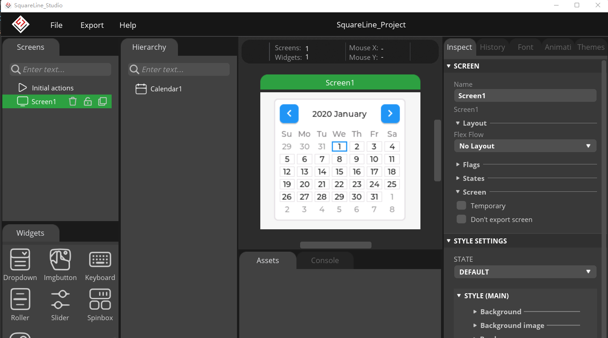
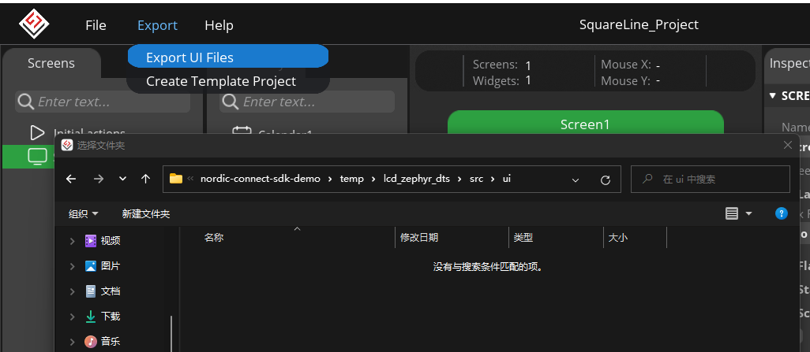
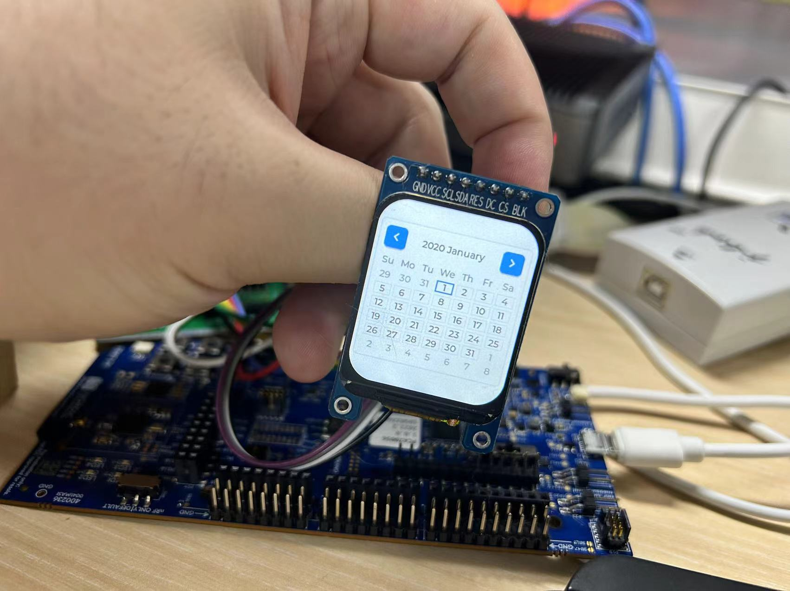

## Introduction
This demo demonstrates how to port LVGL code generated by SquareLine to a Zephyr project. This demo is based on `Appliance\lcd_st7789v2\lcd_zephyr_dts`, so please refer to the readme.md of this demo first.

## Key Code
* Prepare Zephyr Project
  
  Open or make a copy of the `Appliance\lcd_st7789v2\lcd_zephyr_dts` project.

* Create a `SquareLine` project
    
    Create a new project in `SquareLine`. I used `VS Code with SDL for development on PC`, set the resolution to `280x240`, color depth to `16bit`, project path is not required, then click the `CREATE` button to create the project.

    

* UI Design
    
    Design the UI in SquareLine.

    

* Export UI Files
  
  Click the `Export UI Files` button in the `Export` menu in `SquareLine`, then export the files to the newly created `ui` folder in the `src` directory of our Zephyr project; there may be some error prompts during the export process, which can be ignored. Now our UI files are in place.

    

* Import UI Files to Zephyr Project

  In the `CMakeLists.txt` file of the `zephyr` project, add the following code to include the `ui` folder in the build target:

    ```cmake
    # SPDX-License-Identifier: Apache-2.0

        cmake_minimum_required(VERSION 3.20.0)

        find_package(Zephyr REQUIRED HINTS $ENV{ZEPHYR_BASE})
        project(lvgl_temp)

        file(GLOB app_sources src/*.c src/ui/*.c src/ui/components/*.c src/ui/fonts/*.c src/ui/screens/*.c)
        target_sources(app PRIVATE ${app_sources})
        include_directories(src/ui)
    ```
    Here, `src/ui` is the path to the UI folder we exported, and `src/ui/components`, `src/ui/fonts`, `src/ui/screens` are the folder paths in the code generated by SquareLine. Modify these paths according to the actual situation.

* Fix Errors During Compilation

    When we compile the files, an error will occur:

    ```shell
    In file included from ../src/ui/ui_helpers.h:13,
                    from ../src/ui/ui_helpers.c:6:
    ../src/ui/ui.h:13:10: fatal error: lvgl/lvgl.h: No such file or directory
    13 | #include "lvgl/lvgl.h"
        |          ^~~~~~~~~~~~~
    compilation terminated.
    [46/353] Building C object CMakeFiles/app.dir/src/main.c.obj
    ninja: build stopped: subcommand failed.
    ```

    Here, we need to modify `#include "lvgl/lvgl.h"` to `#include "lvgl.h"` in the `src/ui/ui.h` file. After making this change, recompile the code.

* Initialize the UI
  
  Initialize the UI where we want to run it. Here, I initialize the UI in `main.c`, add the header file

    ```c
    #include "ui.h"
    ```

  Then, initialize the UI in the `main` function

    ```c
        int main(void)
        {
            // ...
            ui_init();
            lv_task_handler();
            //...
        }
    ```
    Now our UI should be running.

* Compile and Flash

  Compile and flash the code to the development board to see our UI interface.

    


With this, we have completed the process of porting LVGL code generated by SquareLine to a Zephyr project. Designing UI, calling LVGL APIs, designing interaction logic, and other content will need to be implemented by individuals.
