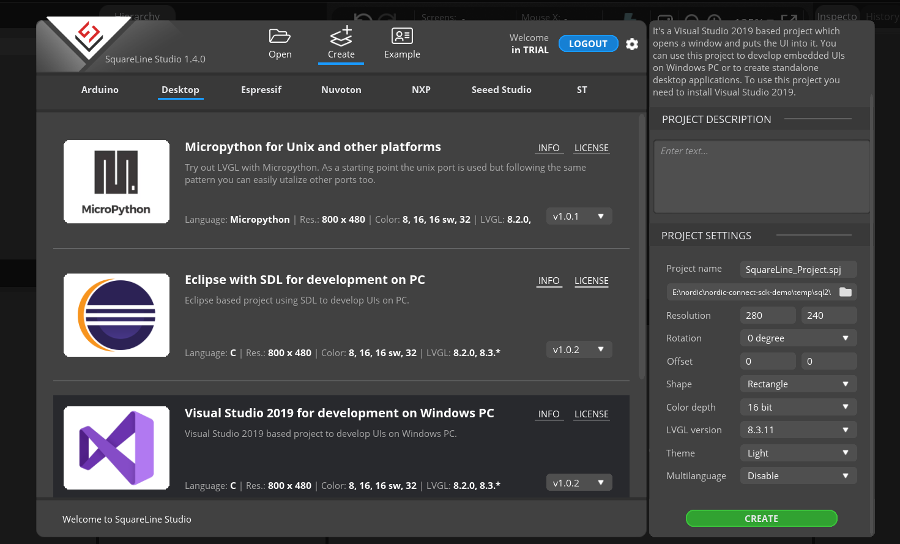
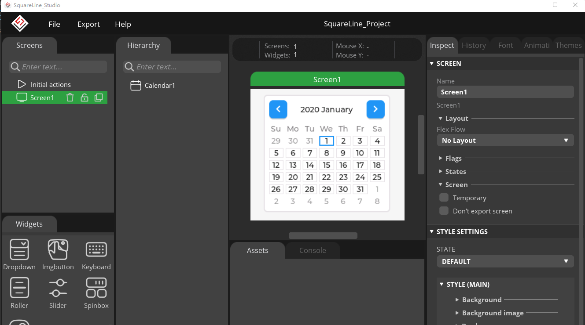
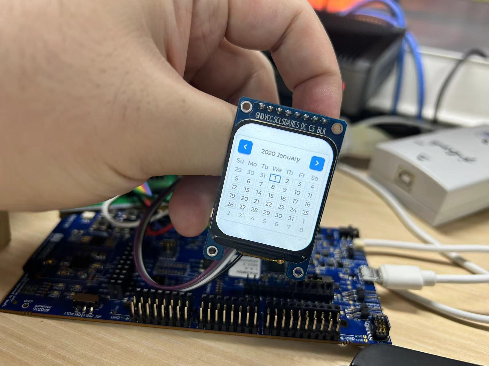

## 简介
这个demo演示了如何移植SquareLine生成的LVGL代码到Zephyr工程中。这个demo是在`Appliance\lcd_st7789v2\lcd_zephyr_dts`的基础上修改的，所以请先参考这个demo的readme.md。

## 关键代码
* 准备Zephyr工程
  
  打开或复制一份`Appliance\lcd_st7789v2\lcd_zephyr_dts`工程

* 新建`SquareLine`工程
    
    在`SquareLine`中创建一个新的工程，我这里使用的是`VS Code with SDL for development on PC`,分辨率设置为`280x240`，颜色深度设置为`16bit`，项目路径没有要求,然后点击`CREATE`按钮创建工程。

    

* UI界面设计
    
    然后在SquareLine中设计好界面

    

* 导出UI文件
  
  在`SquareLine`中点击`Export`菜单中的`Export UI Files`按钮，然后将文件导出到我们zephyr工程中`src`目录下新建的`ui`文件夹中;导出过程会有些错误提示，可以忽略。到此我们的UI文件已经就位了；

    

* 导入UI文件到Zephyr工程

  在`zephyr`工程中的`CMakeLists.txt`文件中添加如下代码，将`ui`文件夹添加到编译目标中：

    ```cmake
    # SPDX-License-Identifier: Apache-2.0

        cmake_minimum_required(VERSION 3.20.0)

        find_package(Zephyr REQUIRED HINTS $ENV{ZEPHYR_BASE})
        project(lvgl_temp)

        file(GLOB app_sources src/*.c src/ui/*.c src/ui/components/*.c src/ui/fonts/*.c src/ui/screens/*.c)
        target_sources(app PRIVATE ${app_sources})
        include_directories(src/ui)
    ```
    这里的`src/ui`是我们导出的UI文件夹的路径，`src/ui/components`、`src/ui/fonts`、`src/ui/screens`是SquareLine生成的代码中的文件夹路径，这里需要根据实际情况修改。

* 修改编译过程中的错误

    这时候我们编译一次文件，回出现一个错误；

    ```shell
    In file included from ../src/ui/ui_helpers.h:13,
                    from ../src/ui/ui_helpers.c:6:
    ../src/ui/ui.h:13:10: fatal error: lvgl/lvgl.h: No such file or directory
    13 | #include "lvgl/lvgl.h"
        |          ^~~~~~~~~~~~~
    compilation terminated.
    [46/353] Building C object CMakeFiles/app.dir/src/main.c.obj
    ninja: build stopped: subcommand failed.
    ```

    这里我们将`src/ui/ui.h`文件中的`#include "lvgl/lvgl.h"`修改为`#include "lvgl.h"`，然后再次编译，就可以通过了。

* 初始化`ui`
  
  在我们要运行`ui`的地方初始化`ui`，这里我在`main.c`中初始化`ui`,加入头文件

    ```c
    #include "ui.h"
    ```

  然后在`main`函数中初始化`ui`

    ```c
        int main(void)
        {
            // ...
            ui_init();
            lv_task_handler();
            //...
        }
    ```
    这样我们的`ui`就可以运行了。

* 编译并烧录

  编译并烧录到开发板上，就可以看到我们的`ui`界面了。

    


到这里，我们就完成了SquareLine生成的LVGL代码移植到Zephyr工程中的过程。UI设计，LVGL的API调用，交互逻辑设计等内容就需要大家自己去实现了。