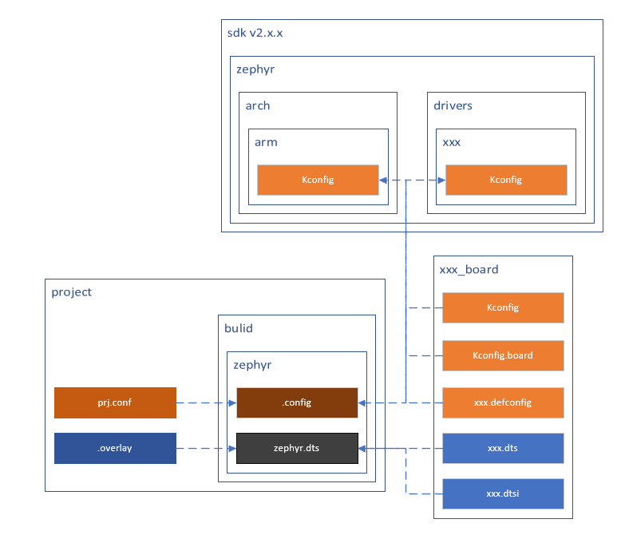

<!--
 * @Author: emmovo
 * @Date: 2023-12-05 08:57:03
 * @LastEditors: emmovo mingjkl@live.com
 * @LastEditTime: 2023-12-05 11:57:32
 * @FilePath: \0_project\README.md
 * @Description: 
 * 
 * Copyright (c) 2023 by mingjkl@live.com/emmovo.com, All Rights Reserved. 
-->

## 工程目录

* CMakeLists.txt
  * 项目构建和配置
* prj.conf
  * 项目自定义的Kconfig配置
* .overlay
  * 项目自定义的设备树内容覆盖
* xxx.c
* xxx.h

## 项目构建
### Kconfig和dts：
  
  Kconfig和dts是项目构建的重要组成部分：
  * 其中Kconfg用于配置内核的各种选项，打开和关闭如外设实例等特地的功能；
    *  可以快速的使能或禁用特定的功能模块、驱动程序或选项；
    *  配置信息和具体的实现代码分离，快速的在平台硬件平台和系统之间移植；
    *  提高代码可读性和维护性；
    *  和nRF5 SDK中的sdk_config.h类似；
  * dts是扳级的设备描述文件，包含设备属性、驱动，内存配置等内容；
    * 硬件配置信息和驱动程序分离，实现硬件和软件的解耦；
    * 硬件抽象成统一的访问方式，软件开发工程师不需要关心底层的硬件信息；\

  在项目构建过程中，会在项目的bulid/zephyr目录下生成.config文件和zephyr.dts文件；

  * .config文件由以下文件内容组成
    * zephyr/arch/Kconfig
    * zephyr/drivers/xxx/Kconfig
    * xxx_board/Kconfig
    * project/prj.conf(优先级最高，会覆盖前面的内容)
  * zephyr.dts文件由以下文件内容组成
    * xxx_board/xxx.dts
    * xxx_board/dtsi
    * project/.overlay(优先级最高，会覆盖前面的内容)
  
  构成关系如下图所示：
  
  
  
### CMakeLists.txt
  * CMakeLists.txt是CMake的配置文件，用于描述项目构建规则和构建过程；
  * 一般会包含以下内容：
    * CMake要求最低版本
    * 项目名称和版本
    * 源文件
    * 头文件
    * ...

## 编写规则
### Kconfig
  * 查阅相关的demo
    * sdk/zephyr/samples
    * sdk/nrf/samples
  * [Konfig search](https://developer.nordicsemi.com/nRF_Connect_SDK/doc/latest/kconfig/index.html)
  * 查看menuconfig的相关配置
### dts
  * 参考sdk/zephyr/boards
  * [Nordic Semiconductor Bindings index](https://developer.nordicsemi.com/nRF_Connect_SDK/doc/latest/zephyr/build/dts/api/bindings.html#dt-vendor-nordic)
  * [Devicetree Guide](https://developer.nordicsemi.com/nRF_Connect_SDK/doc/latest/zephyr/build/dts/index.html)
### CMakeLists.txt
  * [Writing CMakeLists Files](https://cmake.org/cmake/help/book/mastering-cmake/chapter/Writing%20CMakeLists%20Files.html)
  * [emmovo/nRF connect sdk demo/A1_include](https://gitee.com/mingkjl/nordic-connect-sdk-demo/tree/master/A1_include)

