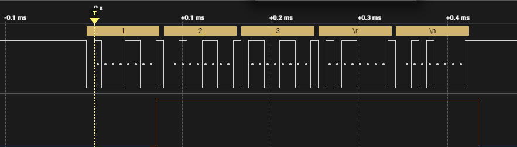

## Introduction
This is a PPI demo written based on `uart_nrfx`. The demo connects the `Data sent from TXD` event of `uart` with a `gpio` through `PPI`. When the event is triggered, it automatically triggers the task of the `gpio` and pulls the pin high. This demo itself does not have a practical purpose but serves to demonstrate the use of `PPI` to establish connections between hardware components without CPU intervention.

## Key Code
* We copy a project from `3_uart\uart_nrfx`.
* 
* It doesn't really affect, but we still modify the log console output in `prj.conf`:
  ```
    CONFIG_USE_SEGGER_RTT=y
    CONFIG_RTT_CONSOLE=y
    CONFIG_UART_CONSOLE=n
  ```
  We change the log output to be through `rtt` instead of `uart`.

* Pin Configuration:
  ```
    #define UART_TX_PIN NRF_GPIO_PIN_MAP(0, 31)
    #define UART_RX_PIN NRF_GPIO_PIN_MAP(0, 8)

    #define DEBUG_PIN NRF_GPIO_PIN_MAP(0,30)
  ```
  The `tx` pin of `uart` used for `debug` on `nRF52840dk` is `P0.06`. We change the `uart`'s `tx` pin to `P0.31`, this change is just for convenience in connecting `P0.31` to a logic analyzer for observation. We also define a `gpio` pin `P0.30` for connecting to the `ppi` task, which we use to observe the trigger condition of `ppi`.

* Add headers to `main.c`:
  ```
    #include <nrfx_ppi.h>
    #include <nrfx_gpiote.h>
  ```

* Configure `gpiote`:
  ```
    nrfx_gpiote_channel_alloc(&gpiote_channel);

	nrfx_gpiote_task_config_t task_config;
	task_config.init_val = NRF_GPIOTE_INITIAL_VALUE_LOW;
	task_config.polarity = NRF_GPIOTE_POLARITY_LOTOHI;
	task_config.task_ch = gpiote_channel;

	nrfx_gpiote_out_config_t out_config = NRFX_GPIOTE_CONFIG_OUT_TASK_HIGH;	
	nrfx_gpiote_output_configure(DEBUG_PIN, &out_config, &task_config);
	nrfx_gpiote_out_task_enable(DEBUG_PIN);
  ```
  Here, we use `nrfx_gpiote_channel_alloc` to allocate a `gpiote` channel, then configure the task with `task_config`. The `task`'s `polarity` is set to `NRF_GPIOTE_POLARITY_LOTOHI`, and its `task_ch` to the just allocated `gpiote` channel, with `init_val` as `NRF_GPIOTE_INITIAL_VALUE_LOW`. The task aims to pull `DEBUG_PIN` high. Then, we define an `nrfx_gpiote_out_config_t` structure `out_config` with default `NRFX_GPIOTE_CONFIG_OUT_TASK_HIGH`, call `nrfx_gpiote_output_configure` to configure the output of `DEBUG_PIN`, and finally `nrfx_gpiote_out_task_enable` to enable the task.

* Allocate a `ppi` channel:
  ```
  nrfx_ppi_channel_alloc(&ppi_channel);
  ```
  Here, we acquire a `ppi` channel allocated by `nrfx_ppi_channel_alloc`, saving this channel in `ppi_channel`.

* Configure the `ppi` channel:
  ```
  nrfx_ppi_channel_assign(ppi_channel,
							nrf_uarte_event_address_get(NRF_UART0, NRF_UARTE_EVENT_TXDRDY),
							nrf_gpiote_task_address_get(NRF_GPIOTE, nrf_gpiote_out_task_get(gpiote_channel)));
  ```
  We configure the `ppi` channel by obtaining the address of the `uart`'s `Data sent from TXD` event and the `gpiote`'s task with `nrf_uarte_event_address_get` and `nrf_gpiote_task_address_get`, respectively, then use `nrfx_ppi_channel_assign` to connect them.

* Enable the `ppi` channel:
  ```
  nrfx_ppi_channel_enable(ppi_channel);
  ```
  With this, we have implemented the functionality mentioned earlier. When the `uart`'s `Data sent from TXD` event is triggered, it triggers the `gpiote`'s task, which pulls `DEBUG_PIN` high.

* Reset the `gpiote` task in the UART interrupt function, under the `NRFX_UARTE_EVT_TX_DONE` event:
    ```
    static void uart_handler(nrfx_uarte_event_t const * p_event, void * p_context)
    {

        switch (p_event->type) {
            case NRFX_UARTE_EVT_TX_DONE:
                nrfx_gpiote_clr_task_trigger(DEBUG_PIN);
                break;
            // .....
            default:
                break;
        }

    }
    ```

* Compile and flash the program, then use an oscilloscope or logic analyzer to observe the changes in `UART_TX_PIN` and `DEBUG_PIN`.
  
  
  
  We use a UART debugging tool to send data to the development board, my sent data was `123\r\n`; since the `3_uart\uart_nrfx` project implements the function of UART data loopback, the development board, upon receiving our data, will send it back. At this moment, we can see the changes in `UART_TX_PIN` and `DEBUG_PIN`.

  Through an oscilloscope or logic analyzer, we can observe that after `UART_TX_PIN` completes the stop bit transmission of the first byte, `DEBUG_PIN` changes from low to high. After the complete data field `123\r\n` is sent, `DEBUG_PIN` changes back to low.