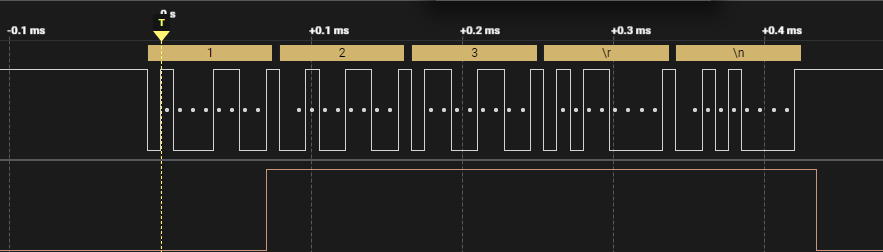

## Introduction
This is a PPI (Peripheral Peripheral Interconnect) demo based on `uart_nrfx`, but the PPI functionality is implemented using register configuration. Yes, I didn't manage to implement it using the `nrfx_ppi` library, but I don't feel like reading the documentation!

Okay, back to this demo. This demo connects the "Data sent from TXD" event of UART and a GPIO using PPI. When the event is triggered, it automatically triggers the GPIO task and pulls the pin high. This demo itself doesn't have any real significance; it's just meant to demonstrate the use of PPI to establish hardware-to-hardware connections without CPU intervention.


## Key Code
* Copy a `3_uart\uart_nrfx` project.

* Change the `prj.conf` log console output (not mandatory, but we'll do it):
  ```
    CONFIG_USE_SEGGER_RTT=y
    CONFIG_RTT_CONSOLE=y
    CONFIG_UART_CONSOLE=n
  ```
  We change the log output to use `RTT` instead of `UART`.

* Pin configuration:
  ```c
    #define UART_TX_PIN NRF_GPIO_PIN_MAP(0, 31)
    #define UART_RX_PIN NRF_GPIO_PIN_MAP(0, 8)

    #define DEBUG_PIN NRF_GPIO_PIN_MAP(0, 30)
  ```
  The UART TX pin on the nRF52840 DK used for debugging UART is P0.06. We change the UART TX pin to P0.31 for easier connection to a logic analyzer. Additionally, we define a GPIO pin, DEBUG_PIN, which we'll use to connect to a PPI task for observing PPI triggers.

* Add the necessary header files to `main.c`:
  ```c
    #include <nrfx_ppi.h>
    #include <nrfx_gpiote.h>
  ```

* Configure GPIOTE (General Purpose Input/Output Task and Event):
  ```c
  NRF_GPIOTE->CONFIG[0] = (GPIOTE_CONFIG_MODE_Task << GPIOTE_CONFIG_MODE_Pos) |
							(DEBUG_PIN << GPIOTE_CONFIG_PSEL_Pos) |
							(GPIOTE_CONFIG_OUTINIT_High << GPIOTE_CONFIG_POLARITY_Pos);
  ```
  Here, we configure a GPIOTE task in task mode. The task is associated with the DEBUG_PIN and is configured to trigger with a high level, which means it will pull the pin high when triggered.

* Obtain an allocated PPI channel:
  ```c
  nrf_ppi_channel_t ppi_channel;
  nrfx_ppi_channel_alloc(&ppi_channel);
  ```
  Here, we obtain a PPI channel allocated using `nrfx_ppi_channel_alloc`. The allocated PPI channel is stored in `ppi_channel`.

* Configure the PPI channel:
  ```c
  NRF_PPI->CH[ppi_channel].EEP = (uint32_t)&NRF_UART0->EVENTS_TXDRDY;
  NRF_PPI->CH[ppi_channel].TEP = (uint32_t)&NRF_GPIOTE->TASKS_OUT[0];
  ```
  Here, we configure the PPI channel's EEP (Event End Point) to the "Data sent from TXD" event of UART and the TEP (Task End Point) to the GPIOTE task we configured earlier.

* Enable the PPI channel:
  ```c
  NRF_PPI->CHENSET = 1 << ppi_channel;
  ```
  With this step, we have implemented what we discussed earlier. When the "Data sent from TXD" event of UART triggers, it will also trigger the GPIOTE task, which will pull DEBUG_PIN high. To ensure proper behavior, we should pull DEBUG_PIN low at the appropriate time; otherwise, it will stay high after being triggered.

* Add GPIO task reset in the UART interrupt handler. In the `NRFX_UARTE_EVT_TX_DONE` event, add:
  ```c
    static void uart_handler(nrfx_uarte_event_t const * p_event, void * p_context)
    {
        switch (p_event->type) {
            case NRFX_UARTE_EVT_TX_DONE:
                NRF_GPIOTE->TASKS_CLR[0] = PPI_TASKS_CHG_EN_EN_Msk | ppi_channel;
                break;
            // .....
            default:
                break;
        }
    }
  ```

* Compile and flash the program. Observe the changes in `UART_TX_PIN` and `DEBUG_PIN` using an oscilloscope or logic analyzer.

  

  Send data to the development board using a serial debugging tool; for example, send "123\r\n". Since the `3_uart\uart_nrfx` project implements the functionality of echoing serial data, the development board will receive the data and send it back. You can observe the changes in `UART_TX_PIN` and `DEBUG_PIN`.

  Using an oscilloscope or logic analyzer, you will see that `UART_TX_PIN` goes high after completing the first byte's stop bit transmission. After the complete data field "123\r\n" is sent, `DEBUG_PIN` goes low again.