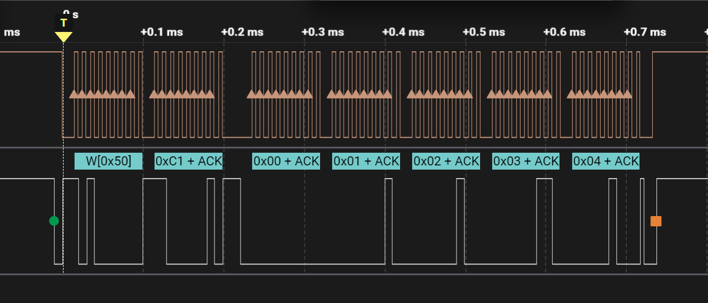
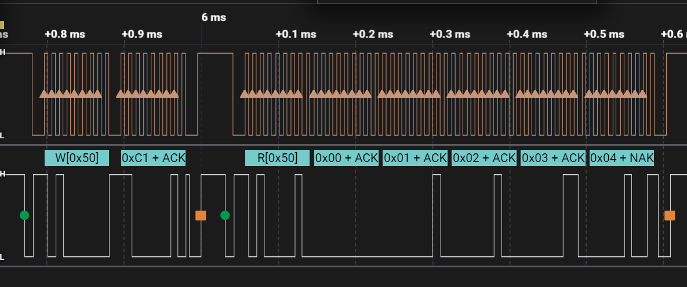

## Introduction
This is a demo for an I2C device using the `zephyr/drivers/i2c.h` driver. The demo demonstrates the usage of I2C in Zephyr by performing read and write operations on an `AT24C02` device.

## Key Code
* Configure I2C in `prj.conf`:
  ```c
    CONFIG_LOG=y
    CONFIG_I2C=y
  ```

* Create an `.overlay` file and add the I2C configuration:
  ```c
  &spi1 {
  status = "disabled";
  };

  &i2c0 {
      status = "disabled";
  };

  &i2c1 {
      status = "okay";
      clock-frequency = <400000>;
  };

  &i2c1_default {
      group1 {
          psels = <NRF_PSEL(TWIM_SDA, 0, 31)>, <NRF_PSEL(TWIM_SCL, 0, 30)>;
      };
  };
  ```
  In this configuration, we disable `spi1` and `i2c0` to avoid conflicts on the `nrf52840dk` board. We enable `i2c1` and set the clock frequency to `400000`. We also configure the pin mappings (`psels`) for `i2c1`, where `TWIM_SDA` and `TWIM_SCL` correspond to `P0.31` and `P0.30` on the `nrf52840dk` board.

* Include the necessary header files in `main.c`:
  ```c
      #include <zephyr/device.h>
      #include <zephyr/devicetree.h>
      #include <zephyr/logging/log.h>
      #include <zephyr/drivers/i2c.h>
  ```

* Define an I2C device:
  ```c
      const struct device *i2c_dev = DEVICE_DT_GET(DT_NODELABEL(i2c1));
  ```

* Check if the I2C device is ready before using it:
  ```c
      if (!device_is_ready(i2c_dev)) {
          LOG_ERR("I2C device is not ready");
          return -1;
      } else {
          LOG_INF("I2C device is ready");
      }
  ```

* Perform I2C read and write operations using the `i2c_transfer` function:
  * The function takes the following parameters:
    * `i2c_dev`: The I2C device.
    * `msg`: An array of `i2c_msg` structures that hold the data to be read or written.
    * `num_msgs`: The number of messages in the `msg` array.
    * `addr`: The device address, a 7-bit address without the read/write flag.
  * The `i2c_msg` structure:
    * `buf`: The data buffer, pointing to an array.
    * `len`: The length of the data.
    * `flags`: The read/write flags.
  * Control the read/write operations using the following flags:
    * `I2C_MSG_WRITE`: Write flag.
    * `I2C_MSG_READ`: Read flag.
    * `I2C_MSG_RESTART`: Restart flag.
    * `I2C_MSG_STOP`: Stop flag.

* Read and write data from/to the `AT24C02` device:
  * Write data:
    * Write the device address, followed by the memory address, and finally the data.
    * Pass the device address as a parameter to the `i2c_transfer` function.
    * Put the memory address and data in the `i2c_msg` structure. You can use an array and store the memory address in `i2c_msg.buf[0]` and the data in `i2c_msg.buf[1]` and onwards. Alternatively, you can use two `i2c_msg` structures, one for writing the memory address and another for writing the data.
    * Make sure to add the `I2C_MSG_STOP` flag to the last `i2c_msg` structure.
  * Read data:
    * Write the device address, followed by the memory address, write the device address again, and finally read the data.
    * Pass the device address as a parameter to the `i2c_transfer` function.
    * Use two `i2c_msg` structures, one for writing the memory address and another for reading the data.
    * Set the `flags` of the `i2c_msg` structure for writing the memory address to `I2C_MSG_WRITE | I2C_MSG_STOP`, and set the `flags` for reading the data to `I2C_MSG_READ | I2C_MSG_STOP`.

* For detailed read and write operations on the EEPROM, please refer to the specific code.
* Compile and flash the code. You can check the success of the data read and write through the logs, and you can also observe the I2C data read and write using a logic analyzer. The screenshots below show the logic analyzer captures:
  * Write process
    

  * Read process
    