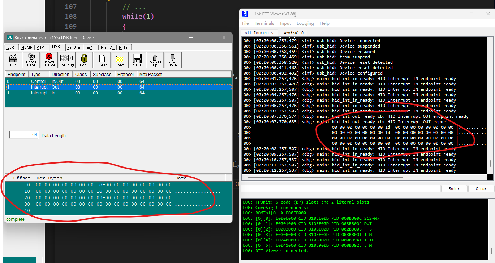
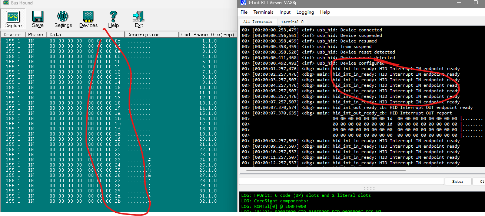

## Introduction
This is a demo implementing USB HID pass-through.

## Key Code
* Add `USB HID` configuration in `prj.conf`
    ```c
        CONFIG_USB_DEVICE_STACK=y
        CONFIG_USB_DEVICE_HID=y
        CONFIG_USB_DEVICE_PRODUCT="Zephyr HID Transparent"
        CONFIG_USB_DEVICE_PID=0x0007
        CONFIG_USB_DEVICE_INITIALIZE_AT_BOOT=n

        CONFIG_ENABLE_HID_INT_OUT_EP=y
        CONFIG_HID_INTERRUPT_EP_MPS=64

        CONFIG_LOG=y
    ```
    Here we configure parameters related to `USB HID`. `CONFIG_USB_DEVICE_PID` is custom, `CONFIG_USB_DEVICE_PRODUCT` is the device name, `CONFIG_ENABLE_HID_INT_OUT_EP` enables the `HID` interrupt endpoint, `CONFIG_HID_INTERRUPT_EP_MPS` is the maximum packet size of the interrupt endpoint, and we include `LOG` configuration for debugging purposes, although not elaborated here, refer to the code for details.

* Include necessary headers in `main.c`
    ```c
    #include <zephyr/device.h>
    #include <zephyr/usb/usb_device.h>
    #include <zephyr/usb/class/usb_hid.h>
    ```

* Define the `HID` device
    ```c
    const struct device *hid_dev;
    ```

* Get the `HID` device
    ```c
    hid_dev = device_get_binding("HID_0");
	if (hid_dev == NULL) {
		LOG_ERR("Cannot get USB HID Device");
		return 0;
	}
    ```

* Define the report descriptor
    ```c
    static const uint8_t custom_hid_report_desc[] = {
	// Report descriptor content
    };
    ```

* Define the `HID` interrupt functions
    ```c
    static void hid_int_out_ready_cb(const struct device *dev)
    {
        // Function implementation
    }

    static void hid_int_in_ready(const struct device *dev)
    {
        // Function implementation
    }

    static const struct hid_ops ops = {
        // Operations assignment
    };
    ```

* Register the `HID` device
    ```c
    usb_hid_register_device(hid_dev,
				custom_hid_report_desc, sizeof(custom_hid_report_desc),
				&ops);
    ```

* Initialize and enable the `HID` device
    ```c
    usb_hid_init(hid_dev);

	ret = usb_enable(status_cb);
	if (ret != 0) {
		LOG_ERR("Failed to enable USB");
		return 0;
	}
    ```

* Simulate data upload
    ```c
    int main(void)
    {
        // Data upload simulation
    }
    ```
    Here we simulate a data upload action, sending data every 1 second.

* Compile and flash the program.
* Verify the program by using the `Bus Hound` tool to observe the data transfer of our `USB HID` device.
  * Data reception by the device
    * Sending data to the device's `OUT` endpoint using the `Bus Hound` tool triggers the interrupt callback function successfully, and data is read successfully in the `RTT Viewer`.

    

    * By simulating data upload in the `main` function, we can see that the device's `IN` endpoint successfully sends data in the `Bus Hound` tool.

    

    With this, we have completed the implementation of bi-directional pass-through functionality for `USB HID`.