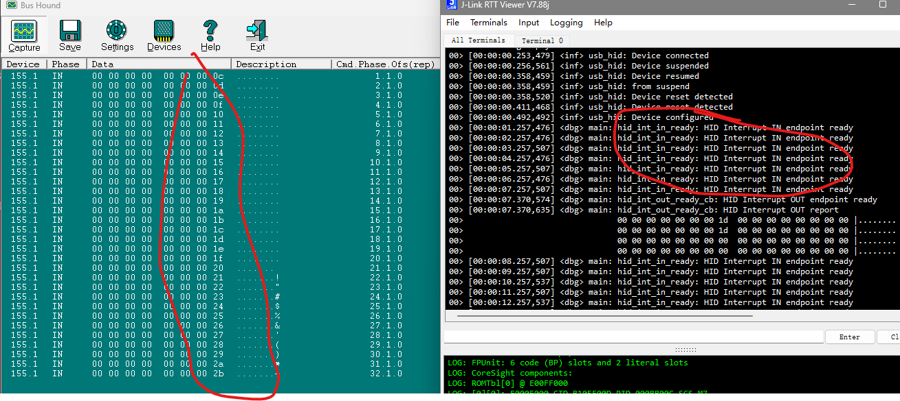

## 简介
这是一个实现usb hid透传的demo

## 关键代码
* 在`prj.conf`中添加`USB HID`的配置
    ```c
        CONFIG_USB_DEVICE_STACK=y
        CONFIG_USB_DEVICE_HID=y
        CONFIG_USB_DEVICE_PRODUCT="Zephyr HID Transparent"
        CONFIG_USB_DEVICE_PID=0x0007
        CONFIG_USB_DEVICE_INITIALIZE_AT_BOOT=n

        CONFIG_ENABLE_HID_INT_OUT_EP=y
        CONFIG_HID_INTERRUPT_EP_MPS=64

        CONFIG_LOG=y
    ```
    这里面配置了`USB HID`的相关参数，其中`CONFIG_USB_DEVICE_PID`是自定义的，`CONFIG_USB_DEVICE_PRODUCT`是设备的名称，
    `CONFIG_ENABLE_HID_INT_OUT_EP`是使能`HID`的中断端点，`CONFIG_HID_INTERRUPT_EP_MPS`是中断端点的最大包大小，
    我们也加入了`LOG`的配置，方便调试，不过不展开介绍，详细看代码。

* 在`main.c`中加入必要的头文件
    ```c
    #include <zephyr/device.h>
    #include <zephyr/usb/usb_device.h>
    #include <zephyr/usb/class/usb_hid.h>
    ```

* 定义`HID`设备
    ```c
    const struct device *hid_dev;
    ```

* 获取`HID`设备
    ```c
    hid_dev = device_get_binding("HID_0");
	if (hid_dev == NULL) {
		LOG_ERR("Cannot get USB HID Device");
		return 0;
	}
    ```

* 定义报告描述符
    ```c
    static const uint8_t custom_hid_report_desc[] = {
	0x06, 0x00, 0xff, // Usage Page = 0xFF00 (Vendor Defined Page 1)
	0x09, 0x00,		  // Usage (0x00)
	0xA1, 0x01,		  // Collection (Application)
	0x09, 0x01,		  // Usage (0x01)
	0x15, 0x00,		  // Logical Minimum (0)
	0x26, 0xFF, 0x00, // Logical Maximum (255)
	0x75, 0x08,		  // Report Size (8)
	0x95, 0x40,		  // Report Count (64)
	0x81, 0x00,		  // Input
	0x09, 0x02,		  // Usage (0x02)
	0x15, 0x00,		  // Logical Minimum (0)
	0x26, 0xFF, 0x00, // Logical Maximum (255)
	0x75, 0x08,		  // Report Size (8)
	0x95, 0x40,		  // Report Count (64)
	0x91, 0x00,		  // Output
	0xC0			  // End Collection
    };
    ```

* 定义`HID`的中断
    ```c
    static void hid_int_out_ready_cb(const struct device *dev)
    {
        LOG_DBG("HID Interrupt OUT endpoint ready");
        hid_int_ep_read(hid_dev, rx_report, sizeof(rx_report), NULL);
        LOG_HEXDUMP_DBG(rx_report, sizeof(rx_report), "HID Interrupt OUT report");
    }

    static void hid_int_in_ready(const struct device *dev)
    {
        // LOG_DBG("HID Interrupt IN endpoint ready");
    }

    static const struct hid_ops ops = {
        .int_out_ready = hid_int_out_ready_cb,
        .int_in_ready = hid_int_in_ready,
    };
    ```

* 注册`HID`设备
    ```c
    usb_hid_register_device(hid_dev,
				custom_hid_report_desc, sizeof(custom_hid_report_desc),
				&ops);
    ```

* 初始化和使能`HID`设备
    ```c
    usb_hid_init(hid_dev);

	ret = usb_enable(status_cb);
	if (ret != 0) {
		LOG_ERR("Failed to enable USB");
		return 0;
	}
    ```

* 写一个模拟的数据上传动作
    ```c
    int main(void)
    {
        // ...
        while(1)
        {
            // ...
            tx_report[7]++;
            tx_report[23]++;

            hid_int_ep_write(hid_dev, tx_report, sizeof(tx_report), NULL);
            k_msleep(1000);
            // ...
        }
    }
    ```
    这里面我们模拟了一个数据上传的动作，每隔1s上传一次数据。

* 编译并烧录程序
* 验证我们的程序，我们使用`Bus Hound`工具来查看我们的`USB HID`设备的数据传输情况
  * 设备的收据接收
    * 我们通过`Bus Hound`工具对设备的`OUT`端点发送数据,在`RTT Viewer`中可以看到成功的触发了中断回调函数，并且成功的读取了数据

    

    * 我们在`main`函数中模拟了数据上传的动作，我们可以在`Bus Hound`工具中看到设备的`IN`端点成功的发送了数据

    

    至此，我们完成了`USB HID`的双向透传功能的实现。