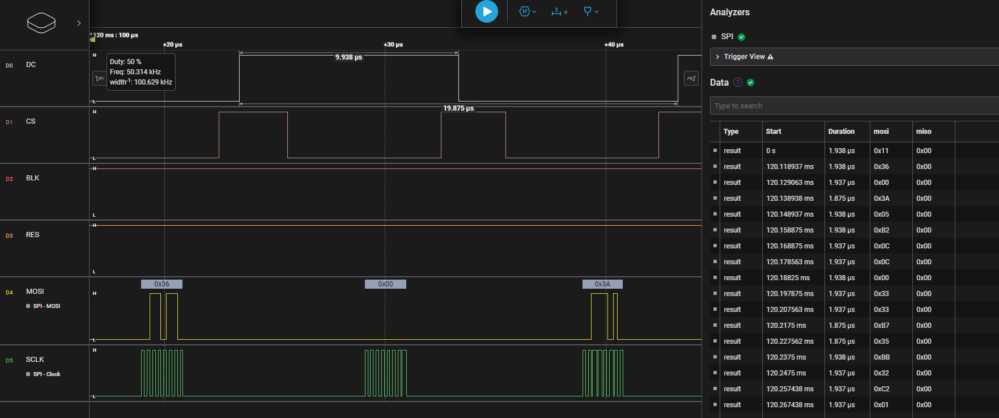

## Introduction
This is a sample routine that utilizes the `nrfx_spi.h` library to drive an ST7789V LCD display. I have already ported the vendor-provided analog SPI driver program based on STM32F103 to an NCS analog version, located in the `Peripherals/6_spi/lcd_soft_spi` directory. This example is based on the ported routine, where the analog SPI is changed to hardware SPI. Only the SPI data read and write interfaces are replaced, while the rest of the code remains unchanged. Through this process, the usage of `nrfx_spi.h` is demonstrated. However, this demo only showcases the writing part, and the reading part is not demonstrated.

## Key Code Snippets
* Add SPI configuration in `prj.conf`
    ```c
    CONFIG_NRFX_SPIM3=y 
    ```
    Here, we are using `SPIM3` to drive the LCD.

* Include necessary header files in `lcd_init.h`
    ```c
    #include "nrfx_spim.h"
    #include "hal/nrf_gpio.h"
    #include <hal/nrf_spim.h>
    ```

* Define an instance of the SPI
    ```c
    static nrfx_spim_t spi_instance = NRFX_SPIM_INSTANCE(3);
    ```
    Here, we define the `SPIM3` configured in `prj.conf`.

* Define a SPI configuration structure
    ```c
    #define LCD_SCLK_PIN NRF_GPIO_PIN_MAP(0, 3)   // SCL
    #define LCD_MOSI_PIN NRF_GPIO_PIN_MAP(0, 4)   // SDA
    #define LCD_RESET_PIN NRF_GPIO_PIN_MAP(0, 28) // RES
    #define LCD_DC_PIN NRF_GPIO_PIN_MAP(0, 31)    // DC
    #define LCD_CS_PIN NRF_GPIO_PIN_MAP(0, 30)    // CS
    #define LCD_BLK_PIN NRF_GPIO_PIN_MAP(0, 29)   // BLK

    nrfx_spim_config_t spi_config = NRFX_SPIM_DEFAULT_CONFIG(LCD_SCLK_PIN, LCD_MOSI_PIN, NRF_SPIM_PIN_NOT_CONNECTED, LCD_CS_PIN);
    ```
    We use the default configuration provided by nrfx, only modifying the `SCLK`, `MOSI`, and `CS` pins.

    * Modify the SPI configuration
        ```c
        spi_config.frequency = NRF_SPIM_FREQ_8M;
        spi_config.mode = NRF_SPIM_MODE_0;
        spi_config.bit_order = NRF_SPIM_BIT_ORDER_MSB_FIRST;
        ```
        If we need to change the default configuration, we can modify the members of the `spi_config` structure. Note that the data type of `.frequency` may vary between SDK versions. If compilation fails, check the data types in the `nrfx_spim_config_t` structure in `nrfx_spim.h`.

* Initialize the SPI
    ```c
    nrfx_spim_init(&spi_instance, &spi_config, NULL, NULL);
    ```
    Here, the third parameter is the interrupt callback function, which is not used in this case, so `NULL` is passed.

* Write data
    ```c
    void SPI_write(uint8_t *data, uint16_t len)
    {
        nrfx_spim_xfer_desc_t spi_tx_buff = NRFX_SPIM_XFER_TX(data, len);
        nrfx_spim_xfer(&spi_instance, &spi_tx_buff, 0);
    }
    ```
    Here, the write operation is encapsulated into a function. The first parameter passed to `NRFX_SPIM_XFER_TX` is the data address, and the second parameter is the data length. Then, `nrfx_spim_xfer` is called to send the data.

* Read data
    ```c
    void SPI_read(uint8_t *data, uint16_t len)
    {
        nrfx_spim_xfer_desc_t spi_rx_buff = NRFX_SPIM_XFER_RX(data, len);
        nrfx_spim_xfer(&spi_instance, &spi_rx_buff, 0);
    }
    ```
    This is the read operation, which is not called in the project. The functionality has not been verified yet. I will test it with a different SPI device next time.

* Compile and run the program
* Use a logic analyzer to observe the SPI timing and verify successful data transmission

    

    