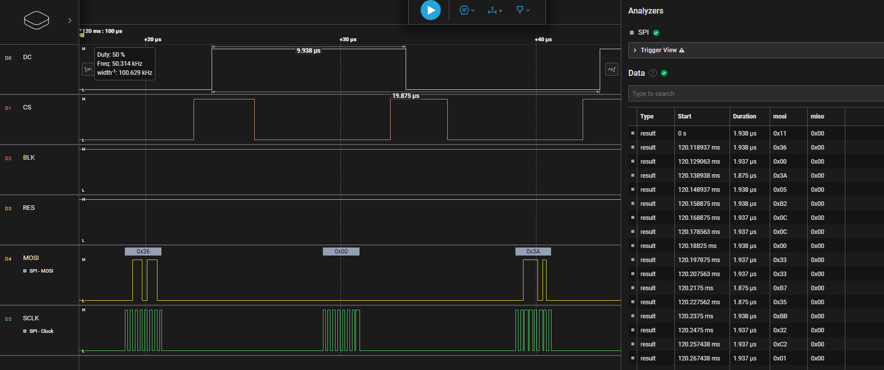

## 简介
这是一个使用`nrfx_spi.h`库实现对st7789v的lcd驱动的例程。关于st7789v的驱动，我这里已经将商家提供的基于STM32F103的模拟SPI驱动程序移植为NCS模拟版本，代码在`Peripherals/6_spi/lcd_soft_spi`目录下。这个例程是基于这个移植的例程，将模拟SPI改为硬件SPI；只更换了SPI数据读写的接口，其他代码保持不变。通过以上过程演示`nrfx_spi.h`的使用方法。不过这个demo中只演示了写部分，读部分没有得到体现。

## 关键代码
* 在`prj.conf`中添加spi配置
    ```c
    CONFIG_NRFX_SPIM3=y 
    ```
    这里我们使用的是`SPIM3`，对LCD进行驱动。

* 在`lcd_init.h`中添加必要的头文件
    ```c
    #include "nrfx_spim.h"
    #include "hal/nrf_gpio.h"
    #include <hal/nrf_spim.h>
    ```

* 定义一个`spi`实例
    ```c
    static nrfx_spim_t spi_instance = NRFX_SPIM_INSTANCE(3);
    ```
    这里定义的就是前面我们在`prj.conf`中配置的`SPIM3`。

* 定义一个spi配置结构体
    ```c

    #define LCD_SCLK_PIN NRF_GPIO_PIN_MAP(0, 3)   // SCL
    #define LCD_MOSI_PIN NRF_GPIO_PIN_MAP(0, 4)   // SDA
    #define LCD_RESET_PIN NRF_GPIO_PIN_MAP(0, 28) // RES
    #define LCD_DC_PIN NRF_GPIO_PIN_MAP(0, 31)    // DC
    #define LCD_CS_PIN NRF_GPIO_PIN_MAP(0, 30)    // CS
    #define LCD_BLK_PIN NRF_GPIO_PIN_MAP(0, 29)   // BLK

    nrfx_spim_config_t spi_config = NRFX_SPIM_DEFAULT_CONFIG(LCD_SCLK_PIN, LCD_MOSI_PIN, NRF_SPIM_PIN_NOT_CONNECTED, LCD_CS_PIN);
    ```
    我们使用nrfx提供的默认配置，只需要修改`SCLK`、`MOSI`、`CS`引脚即可。

    * 变更spi配置
        ```c
        spi_config.frequency = NRF_SPIM_FREQ_8M;
        spi_config.mode = NRF_SPIM_MODE_0;
        spi_config.bit_order = NRF_SPIM_BIT_ORDER_MSB_FIRST;
        ```
        如果我们需要变更默认配置，可以修改`spi_config`结构体中的成员变量。注意，这里`.frequency`的数据类型在`SDK2.4.x`和`SDK2.5.x`中是不一样的。如果编译不过，可以在`nrfx_spim.h`中查看`nrfx_spim_config_t`结构体中的成员变量的数据类型。

* 初始化spi
    ```c
    nrfx_spim_init(&spi_instance, &spi_config, NULL, NULL);
    ```
    这里第三个参数是中断回调函数，我们这里不使用中断，所以传入`NULL`。

* 写数据
    ```c
    void SPI_write(uint8_t *data, uint16_t len)
    {
        nrfx_spim_xfer_desc_t spi_tx_buff = NRFX_SPIM_XFER_TX(data, len);
        nrfx_spim_xfer(&spi_instance, &spi_tx_buff, 0);
    }
    ```
    这里面我们将写数据的操作封装成了一个函数，传入到`NRFX_SPIM_XFER_TX`的第一个参数是数据的地址，第二个参数是数据的长度。然后调用`nrfx_spim_xfer`函数进行数据的发送。

* 读数据
    ```c
    void SPI_read(uint8_t *data, uint16_t len)
    {
        nrfx_spim_xfer_desc_t spi_rx_buff = NRFX_SPIM_XFER_RX(data, len);
        nrfx_spim_xfer(&spi_instance, &spi_rx_buff, 0);
    }
    ```
    这里是读数据的操作，工程中没有调用到这个函数，功能没有验证，下次我换个其他的spi设备再验证一下。

* 编译并运行程序
* 通过逻辑分析仪观察spi时序，验证数据是否发送成功
    
    

    