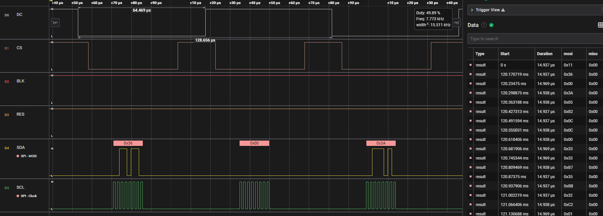

> Warning: This project needs to be built on NCS v2.5.x and newer versions!

## Introduction
This demo demonstrates how to implement an SPI driver for the st7789v LCD driver using Zephyr RTOS API. I have ported the vendor-provided analog SPI driver for the st7789v based on STM32F103 to an NCS analog version, and the code can be found in the `Peripherals/6_spi/lcd_soft_spi` directory. This example is based on this ported code, where the analog SPI is changed to hardware SPI. Only the SPI data read/write interface has been replaced, while the rest of the code remains unchanged. This demo showcases the usage of the `spi` under the Zephyr API. However, only the write part is demonstrated in this demo, and the read part is not implemented.

## Key Code
* Add SPI configuration in `prj.conf`
    ```c
    CONFIG_SPI=y
    ```
* Create a `.overlay` file and add SPI configuration
    ```c
    &spi0 {
        compatible = "nordic,nrf-spim";
        status = "okay";
        cs-gpios = <&gpio0 30 GPIO_ACTIVE_LOW>;
        pinctrl-0 = < &spi0_default >;
        reg_dev:spi_dev@0 {
            reg = <0>;
        };
    };

    &spi0_default {
        group1 {
            psels = <NRF_PSEL(SPIM_SCK, 0, 3)>, <NRF_PSEL(SPIM_MOSI, 0, 4)>;
        };
    };
    ```
    Here, the `status` of `spi0` is set to `okay`. The default pin configuration of `spi0` is modified, setting `SCK` and `MOSI` to `P0.03` and `P0.04`, respectively. The `CS` pin is set to `P0.30` and is set as active low. A `spi_dev` device is added under `spi0`, with `reg` set to `0`. This step is crucial as the `bus` of the `spi` needs to be specified in the initialization function, and here `bus` is `spi_dev`.

* Include necessary header files
    ```c
    #include "hal/nrf_gpio.h"
    #include <zephyr/drivers/spi.h>
    #include <zephyr/device.h>
    #include <zephyr/devicetree.h>
    #include <zephyr/drivers/gpio.h>
    ```

* Define and retrieve the SPI node device
    ```c
    const struct device *spi = DEVICE_DT_GET(DT_NODELABEL(spi0));
    ```

* Define the SPI configuration
    ```c
    struct spi_config spi_cfg = {
        .operation = SPI_OP_MODE_MASTER | SPI_TRANSFER_MSB | SPI_WORD_SET(8) | SPI_LINES_SINGLE,
        .frequency = 8000000,
        .slave = 0,
        .cs = {
            .gpio = SPI_CS_GPIOS_DT_SPEC_GET(DT_NODELABEL(reg_dev)),
            .delay = 2,
        }
    };
    ```
    Here, the `.operation` is configured as master mode, transfer mode as MSB, word length as 8 bits, and single line. `.frequency` is set to 8MHz; `.slave` is set to 0, which is used when it is a slave. `.cs` is set to `SPI_CS_GPIOS_DT_SPEC_GET(DT_NODELABEL(reg_dev))`, where `reg_dev` is the `spi_dev` device defined in the `.overlay` file.

* Check if the SPI node device exists
    ```c
    int SPI_init(void)
    {
        if (!device_is_ready(spi))
        {
            printk("SPI device is not ready\n");
            return -1;
        }

        return 0;
    }
    ```

* Write data over SPI
    ```c
    void SPI_write(uint8_t *data, uint16_t len)
    {
        struct spi_buf tx_buf = {
            .buf = data,
            .len = len
        };

        struct spi_buf_set tx = {
            .buffers = &tx_buf,
            .count = 1
        };

        int ret = spi_write(spi, &spi_cfg, &tx);
    }
    ```
    Here, the `spi_write` function is used to write data. `spi` is the SPI node device, `spi_cfg` is the SPI configuration, and `tx` is the SPI data buffer. `tx_buf` represents the data buffer, where `buf` is the data buffer's starting address and `len` is the length of the data buffer. `tx` is the data buffer set, where `buffers` is the starting address of the data buffer set and `count` is the length of the data buffer set.

* Compile and flash the program

