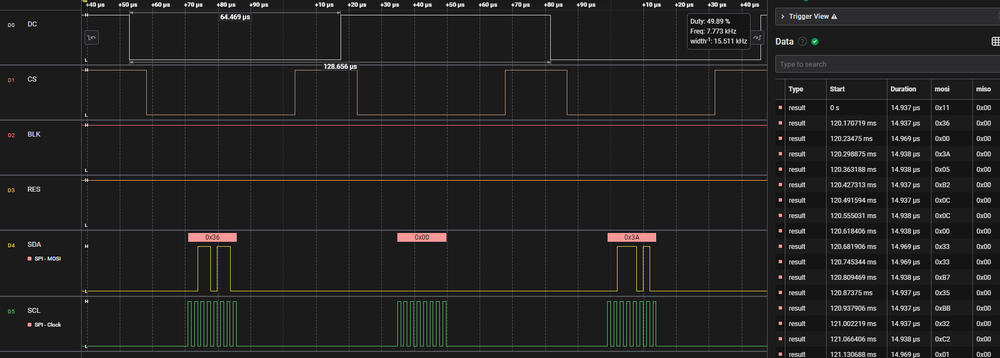

> 警告：本项目需要在NCS v2.5.x及更新版本进行构建！

## 简介
这个demo演示了如何使用Zephyr RTOS API实现SPI驱动st7789v的LCD驱动；关于st7789v的驱动，我这里已经将商家提供的基于STM32F103的模拟SPI驱动程序移植为NCS模拟版本，代码在`Peripherals/6_spi/lcd_soft_spi`目录下。这个例程是基于这个移植的例程，将模拟SPI改为硬件SPI；只更换了SPI数据读写的接口，其他代码保持不变。通过以上过程演示zephyr api下`spi`的使用方法。不过这个demo中只演示了写部分，读部分没有得到体现。

## 关键代码
* 在`prj.conf`中添加spi配置
    ```c
    CONFIG_SPI=y
    ```
* 新建`.overlay`文件，并在其中添加spi配置
    ```c
    &spi0 {
        compatible = "nordic,nrf-spim";
        status = "okay";
        cs-gpios = <&gpio0 30 GPIO_ACTIVE_LOW>;
        pinctrl-0 = < &spi0_default >;
        reg_dev:spi_dev@0 {
            reg = <0>;
        };
    };

    &spi0_default {
        group1 {
            psels = <NRF_PSEL(SPIM_SCK, 0, 3)>, <NRF_PSEL(SPIM_MOSI, 0, 4)>;
        };
    };
    ```
    这里将spi0的`status`设置为`okay`，修改了`spi0`的默认引脚配置，将`SCK`和`MOSI`分别设置为`P0.03`和`P0.04`。`CS`引脚设置为`P0.30`,并且设置为低电平有效。在`spi0`下添加了一个`spi_dev`设备，`reg`设置为`0`。这一步非常重要，因为在`spi`的初始化函数中，需要指定`spi`的`bus`，这里的`bus`就是`spi_dev`。

* 添加必要的头文件
    ```c
    #include "hal/nrf_gpio.h"
    #include <zephyr/drivers/spi.h>
    #include <zephyr/device.h>
    #include <zephyr/devicetree.h>
    #include <zephyr/drivers/gpio.h>
    ```

* 定义并获取spi节点设备
    ```c
    const struct device *spi= DEVICE_DT_GET(DT_NODELABEL(spi0));
    ```

* 定义spi配置
    ```c
    struct spi_config spi_cfg = {
        .operation = SPI_OP_MODE_MASTER | SPI_TRANSFER_MSB | SPI_WORD_SET(8) | SPI_LINES_SINGLE ,
        .frequency = 8000000,
        .slave = 0,
        .cs = {
            .gpio = SPI_CS_GPIOS_DT_SPEC_GET(DT_NODELABEL(reg_dev)),
            .delay = 2,
        }
    };
    ```
    这里配置`.operation`为主机模式，传输模式为`MSB`，字长为8位，线数为单线。`.frequency`设置为8MHz；`.slave`设置为0，这个属性当从机时用到；`.cs`设置为`SPI_CS_GPIOS_DT_SPEC_GET(DT_NODELABEL(reg_dev))`，这里的`reg_dev`就是在`.overlay`文件中定义的`spi_dev`设备。

* 判断spi节点设备是否存在
    ```c
    int SPI_init(void)
    {
        if(!device_is_ready(spi))
        {
            printk("SPI device is not ready\n");
            return -1;
        }

        return 0;

    }
    ```

* spi写数据
    ```c
    void SPI_write(uint8_t *data, uint16_t len)
    {
        struct spi_buf tx_buf = {
            .buf = data,
            .len = len
        };

        struct spi_buf_set tx = {
            .buffers = &tx_buf,
            .count = 1
        };

        int ret = spi_write(spi, &spi_cfg, &tx);
    }
    ```
    这里使用`spi_write`函数写数据，`spi`是`spi`节点设备，`spi_cfg`是`spi`配置，`tx`是`spi`数据缓冲区。其中`tx_buf`是数据缓冲区，`buf`是数据缓冲区的数据首地址，`len`是数据缓冲区的长度。`tx`是数据缓冲区集合，`buffers`是数据缓冲区集合的首地址，`count`是数据缓冲区集合的长度。

* 编译并烧录程序

