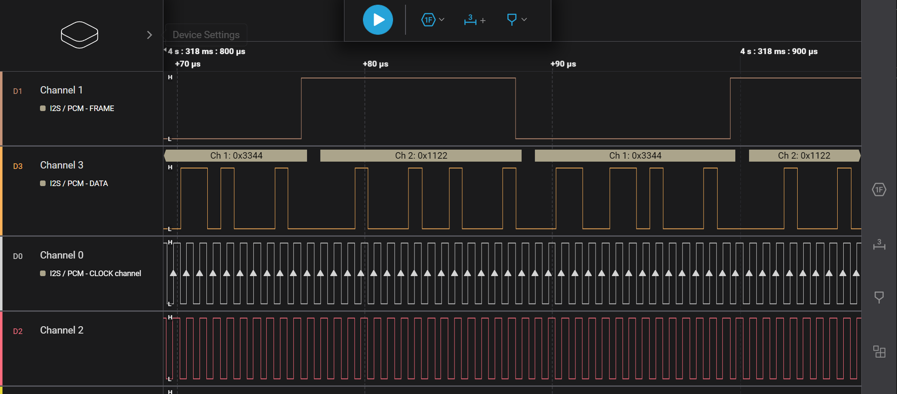

## Introduction
This is a demonstration program for `nrfx_i2s`. The demo only shows the output of a `44.1KHz` `16bit` stereo audio signal through the `i2s` interface; it only demonstrates data output, the data input part is not shown.

## Key Code
* Configure Kconfig
    ```c
    CONFIG_LOG=y
    CONFIG_NRFX_I2S=y
    ```
* Include headers
    ```c
    #include <zephyr/logging/log.h>
    #include <nrfx_i2s.h>
    #include <hal/nrf_gpio.h>
    ```
* Define `i2s` configuration
    ```c
    #define I2S_SCK_PIN NRF_GPIO_PIN_MAP(0, 31)
    #define I2S_LRCK_PIN NRF_GPIO_PIN_MAP(0, 30)
    #define I2S_MCK_PIN NRF_GPIO_PIN_MAP(0, 29)
    #define I2S_SDOUT_PIN NRF_GPIO_PIN_MAP(0, 28)
    #define I2S_SDIN_PIN NRF_GPIO_PIN_MAP(0, 4)

    // ...

    nrfx_i2s_config_t config = NRFX_I2S_DEFAULT_CONFIG(I2S_SCK_PIN,
                                                       I2S_LRCK_PIN,
                                                       I2S_MCK_PIN,
                                                       I2S_SDOUT_PIN,
                                                       I2S_SDIN_PIN);
    config.channels = NRF_I2S_CHANNELS_STEREO;
    config.sample_width = NRF_I2S_SWIDTH_16BIT;
    config.alignment = NRF_I2S_ALIGN_LEFT;
    config.mode = NRF_I2S_MODE_MASTER;
    config.ratio = NRF_I2S_RATIO_32X;
    config.mck_setup = NRF_I2S_MCK_32MDIV23;

    nrfx_i2s_init(&config, i2s_handler);
    ```
* Introduce interrupt
  ```
  IRQ_DIRECT_CONNECT(I2S_IRQn, IRQ_PRIO_LOWEST, nrfx_i2s_irq_handler, 0);
  ```
* Supplement `i2s` interrupt handler function
  ```c
    static void i2s_handler(nrfx_i2s_buffers_t const * p_released, uint32_t status)
    {
        if (status & NRFX_I2S_STATUS_NEXT_BUFFERS_NEEDED)
        {
            i2s_buf_sw = i2s_buf_sw ? 0 : 1;

            nrfx_i2s_buffers_t next_buffers = {
                .p_tx_buffer = m_buffer_tx[i2s_buf_sw],
                .p_rx_buffer = m_buffer_rx[i2s_buf_sw],
            };
            nrfx_i2s_next_buffers_set(&next_buffers);
        }

        if (status & NRFX_I2S_STATUS_TRANSFER_STOPPED)
        {
            nrfx_i2s_buffers_t init_buffers = {
            .p_tx_buffer = m_buffer_tx[0],
            .p_rx_buffer = m_buffer_rx[0],
        };
            nrfx_i2s_start(&init_buffers, I2S_DATA_BLOCK_WORDS, 0);
        }
    }
  ```
  Here, we use a `double buffer` method; when `i2s` needs the next buffer, we switch buffers; when `i2s` transmission stops, we restart the `i2s` transmission.

* Start `i2s` transmission
    ```c
        nrfx_i2s_buffers_t init_buffers = {
            .p_tx_buffer = m_buffer_tx[0],
            .p_rx_buffer = m_buffer_rx[0],
        };

        nrfx_i2s_start(&init_buffers, I2S_DATA_BLOCK_WORDS, 0);
    ```

* Compile and flash the program, we can observe the `i2s` output signal through a logic analyzer; in the demo, we filled the buffer with `0x11223344`, let's see if it has been written to the `i2s` output signal.
* 
    