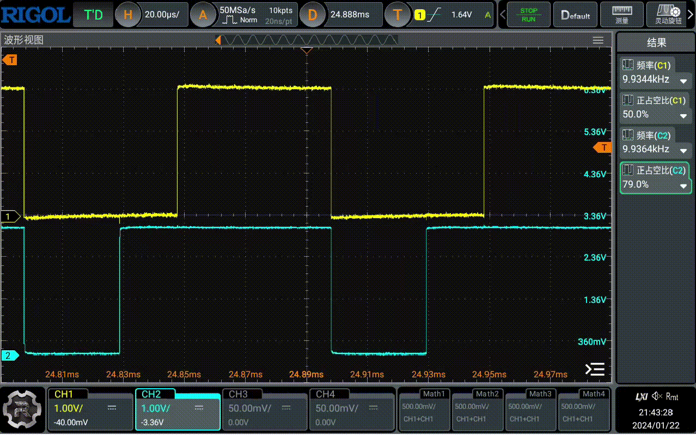

## 简介
这个demo展示了外设pwm的使用，定义了4个pin作为pwm的输出，初始化了两个pwm，分别是pwm0和pwm1，其中pwm0演示了使用独立通道占空比的示例，pwm1演示了使用共用占空比的示例。

## 关键代码
* 在prj.conf中配置pwm的相关信息
    ```
    CONFIG_NRFX_PWM0=y
    CONFIG_NRFX_PWM1=y
    ```
* 加入头文件
    ```
    #include <nrfx_pwm.h>
    #include <hal/nrf_gpio.h>
    ```
* 为了增加代码的可读性，我们写两个函数，一个是将频率转换为topValue的函数，一个是将占空比转换为pwmValue的函数
    ```
    unsigned int frequency_to_topValue(unsigned int frequency)
    {
        unsigned int topValue = 0;
        topValue = 16000000 / frequency;
        return topValue;
    }

    unsigned int dutyCycle_to_pwmValue(unsigned int dutyCycle, unsigned int topValue)
    {
        unsigned int pwmValue = 0;
        pwmValue = (dutyCycle * topValue) / 100;
        return pwmValue;
    }
    ```
    注意，我们这里使用的时钟基准是16MHz，如果使用的时钟基准不是16MHz，需要修改这里的代码。

* 定义pwm实例
  ```
  nrfx_pwm_t pwm0 = NRFX_PWM_INSTANCE(0);
  ```
* 定义pwm配置
  ```
  nrfx_pwm_config_t config0 = NRFX_PWM_DEFAULT_CONFIG(PWM_PIN_0,PWM_PIN_1,NULL,NULL);
  ```
  我们使用了NRFX_PWM_DEFAULT_CONFIG进行了初始化，
  但是我们修改其中的部分内容：
  ```
  unsigned int freq = 10000;
  config0.base_clock = NRF_PWM_CLK_16MHz;
  config0.top_value = frequency_to_topValue(freq);
  config0.load_mode = NRF_PWM_LOAD_INDIVIDUAL;
  ```
  我们使用了16MHz的时钟，设置了pwm的频率，设置了pwm的加载模式为NRF_PWM_LOAD_INDIVIDUAL，这样我们就可以独立设置每个通道的占空比了。

  
  这里只是用了两个pin，将其他两个pin设置为NULL；
  其中PWM_PIN_0和PWM_PIN_1使用了宏定义：
  ```
  #define PWM_PIN_0 NRF_GPIO_PIN_MAP(0, 28)
  #define PWM_PIN_1 NRF_GPIO_PIN_MAP(0, 29)
  ```
* 初始化pwm
  ```
  err_code = nrfx_pwm_init(&pwm0, &config0, NULL, &pwm0);
  ```
  我们没有使用中断，给handler传入了NULL
* 定义独立通道占空比的结构体，这里使用全局量
    ```
    nrf_pwm_values_individual_t pwm_duty;
    ```
    并配置默认值
    ```
    pwm_duty.channel_0 = dutyCycle_to_pwmValue(50, frequency_to_topValue(freq));
    pwm_duty.channel_1 = dutyCycle_to_pwmValue(0, frequency_to_topValue(freq));
    ```
* 初始化占空比配置结构体
    ```
    nrf_pwm_sequence_t seq0 = {
		.values.p_individual = &pwm_duty,
		.length = NRF_PWM_VALUES_LENGTH(pwm_duty),
		.repeats = 1,
		.end_delay = 0
	};

    ```
* 启动pwm
    ```
    err_code = nrfx_pwm_simple_playback(&pwm0, &seq0, 1, NRFX_PWM_FLAG_LOOP);
    ```
    这里使用了nrfx_pwm_simple_playback函数，第二个参数是占空比配置结构体，第三个参数是重复次数，第四个参数是循环标志，这里我们设置为循环播放。

* 我们尝试去改变占空比，做一个动态的占空比变化：
    ```
    uint8_t dynamic_duty = 1;
    uint8_t dynamic_duty_dir = 0;

    while(1)
    {
        
        if(dynamic_duty_dir == 0)
        {
            dynamic_duty+=10;
        }
        else
        {
            dynamic_duty-=10;
        }

        if(dynamic_duty > 90)
        {
            dynamic_duty_dir = 1;
        }
        else if(dynamic_duty < 10)
        {
            dynamic_duty_dir = 0;
        }
        
        pwm_duty.channel_1 = dutyCycle_to_pwmValue(dynamic_duty, frequency_to_topValue(freq));
        k_msleep(100);
    }

    ```
    这部分代码我们加到main里面，实现的效果是pwm1的占空比会在10%和90%之间变化，每100ms变化一次。
* 程序编译并烧录到我们的开发板上，我们用示波器或者逻辑分析仪去测量PWM_PIN_0和PWM_PIN_1的波形，可以看到PWM_PIN_0的占空比是50%，PWM_PIN_1的占空比在10%和90%之间变化，频率为10kHZ。


     


* 接下面我们试试使用共用占空比的方式，我们将pwm1的配置修改为，我们定义pwm1的实例，并且给他另外一个配置：
    ```
        nrfx_pwm_t pwm1 = NRFX_PWM_INSTANCE(1);
        nrfx_pwm_config_t config1 = NRFX_PWM_DEFAULT_CONFIG(PWM_PIN_2,PWM_PIN_3,NULL,NULL);
        unsigned int freq1 = 1000;

        config1.base_clock = NRF_PWM_CLK_16MHz;
        config1.top_value = frequency_to_topValue(freq1);
        config1.load_mode = PWM_DECODER_LOAD_Common;

        err_code = nrfx_pwm_init(&pwm1, &config1, NULL, &pwm1);
    ```
    这里我们为pwm1分配了两个pin，PWM_PIN_2和PWM_PIN_3，我们将pwm1的加载模式设置为PWM_DECODER_LOAD_Common，这样我们就可以使用共用占空比的方式了。频率我们也设置为了1kHZ。
    
    不要忘记了，我们还需要定义一下PWM_PIN2和PWM_PIN3：
    ```
    #define PWM_PIN_2 NRF_GPIO_PIN_MAP(0, 30)
    #define PWM_PIN_3 NRF_GPIO_PIN_MAP(0, 31)
    ```
* 定义共用占空比的结构体
    ```
    nrf_pwm_values_common_t pwm_duty_common[10];
    ```
    这里我们定义的是一个全局的数组，数组的长度是10，这里我们定义了10个占空比；

    并且为数组赋值：
    ```
    for(uint8_t i = 0; i < 10; i++)
	{
		pwm_duty_common[i] = dutyCycle_to_pwmValue(10 * i, frequency_to_topValue(freq1));
	}
    ```
* 初始化占空比配置结构体
    ```
    nrf_pwm_sequence_t seq1 = {
        .values.p_common = pwm_duty_common,
        .length = NRF_PWM_VALUES_LENGTH(pwm_duty_common),
        .repeats = 0,
        .end_delay = 0
    };
    ```
    这里我们使用了NRF_PWM_VALUES_LENGTH宏，这个宏会返回数组的长度，这样我们就可以不用手动去计算数组的长度了。
* 启动pwm
    ```
    err_code = nrfx_pwm_simple_playback(&pwm1, &seq1, 1, NRFX_PWM_FLAG_LOOP);
    ```
* 编译并烧录到开发板上，我们用示波器或者逻辑分析仪去测量PWM_PIN_2和PWM_PIN_3的波形，可以看到PWM_PIN_2和PWM_PIN_3的占空比是一样的，频率为1kHZ，占空比由0%到100%递增，间隔10%，如我们写入到pwm_duty_common中的值一样。
  
   


