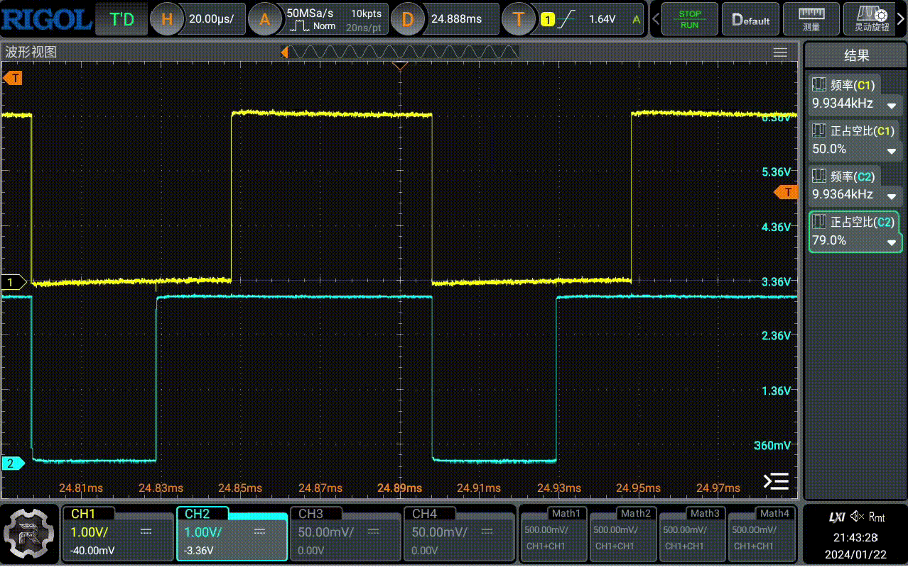

## Introduction
This demo showcases the usage of the PWM peripheral. It defines 4 pins as PWM outputs, initializes two PWM instances, namely PWM0 and PWM1. PWM0 demonstrates an example of using independent channel duty cycles, while PWM1 demonstrates an example of using a common duty cycle.

## Key Code
* Configure PWM-related information in prj.conf:
    ```
    CONFIG_NRFX_PWM0=y
    CONFIG_NRFX_PWM1=y
    ```
* Include header files:
    ```
    #include <nrfx_pwm.h>
    #include <hal/nrf_gpio.h>
    ```
* To improve code readability, two functions are defined: one to convert frequency to topValue and another to convert duty cycle to pwmValue:
    ```
    unsigned int frequency_to_topValue(unsigned int frequency)
    {
        unsigned int topValue = 0;
        topValue = 16000000 / frequency;
        return topValue;
    }

    unsigned int dutyCycle_to_pwmValue(unsigned int dutyCycle, unsigned int topValue)
    {
        unsigned int pwmValue = 0;
        pwmValue = (dutyCycle * topValue) / 100;
        return pwmValue;
    }
    ```
    Note that we use a 16MHz clock base here. If your clock base is different, you need to modify this code accordingly.

* Define PWM instances:
  ```
  nrfx_pwm_t pwm0 = NRFX_PWM_INSTANCE(0);
  ```
* Define PWM configurations:
  ```
  nrfx_pwm_config_t config0 = NRFX_PWM_DEFAULT_CONFIG(PWM_PIN_0,PWM_PIN_1,NULL,NULL);
  ```
  We initialize using NRFX_PWM_DEFAULT_CONFIG but modify some parts:
  ```
  unsigned int freq = 10000;
  config0.base_clock = NRF_PWM_CLK_16MHz;
  config0.top_value = frequency_to_topValue(freq);
  config0.load_mode = NRF_PWM_LOAD_INDIVIDUAL;
  ```
  We use a 16MHz clock, set the PWM frequency, and set the load mode to NRF_PWM_LOAD_INDIVIDUAL, allowing us to independently set the duty cycle for each channel.

  Here, we only use two pins, setting the other two pins to NULL;
  PWM_PIN_0 and PWM_PIN_1 are defined using macros:
  ```
  #define PWM_PIN_0 NRF_GPIO_PIN_MAP(0, 28)
  #define PWM_PIN_1 NRF_GPIO_PIN_MAP(0, 29)
  ```
* Initialize PWM:
  ```
  err_code = nrfx_pwm_init(&pwm0, &config0, NULL, &pwm0);
  ```
  We don't use interrupts, so we pass NULL to the handler.
* Define the duty cycle structure for independent channels globally:
    ```
    nrf_pwm_values_individual_t pwm_duty;
    ```
    and configure default values:
    ```
    pwm_duty.channel_0 = dutyCycle_to_pwmValue(50, frequency_to_topValue(freq));
    pwm_duty.channel_1 = dutyCycle_to_pwmValue(0, frequency_to_topValue(freq));
    ```
* Initialize the duty cycle configuration structure:
    ```
    nrf_pwm_sequence_t seq0 = {
		.values.p_individual = &pwm_duty,
		.length = NRF_PWM_VALUES_LENGTH(pwm_duty),
		.repeats = 1,
		.end_delay = 0
	};

    ```
* Start PWM:
    ```
    err_code = nrfx_pwm_simple_playback(&pwm0, &seq0, 1, NRFX_PWM_FLAG_LOOP);
    ```
    Here, we use the nrfx_pwm_simple_playback function. The second parameter is the duty cycle configuration structure, the third parameter is the number of repetitions, and the fourth parameter is the loop flag, which we set to loop playback.

* We attempt to change the duty cycle to create dynamic changes:
    ```
    uint8_t dynamic_duty = 1;
    uint8_t dynamic_duty_dir = 0;

    while(1)
    {
        
        if(dynamic_duty_dir == 0)
        {
            dynamic_duty+=10;
        }
        else
        {
            dynamic_duty-=10;
        }

        if(dynamic_duty > 90)
        {
            dynamic_duty_dir = 1;
        }
        else if(dynamic_duty < 10)
        {
            dynamic_duty_dir = 0;
        }
        
        pwm_duty.channel_1 = dutyCycle_to_pwmValue(dynamic_duty, frequency_to_topValue(freq));
        k_msleep(100);
    }

    ```
    We add this code to the main function. It creates the effect of PWM1's duty cycle changing between 10% and 90%, with a 100ms interval.
* Compile and flash the program to your development board. Use an oscilloscope or logic analyzer to measure the waveforms of PWM_PIN_0 and PWM_PIN_1. You will observe that the duty cycle of PWM_PIN_0 is 50%, while the duty cycle of PWM_PIN_1 varies between 10% and 90%, with a frequency of 10kHz.

   

* Next, let's try using a common duty cycle. We modify the configuration for PWM1 as follows. We define another PWM instance for PWM1 and provide it with a different configuration:
    ```
        nrfx_pwm_t pwm1 = NRFX_PWM_INSTANCE(1);
        nrfx_pwm_config_t config1 = NRFX_PWM_DEFAULT_CONFIG(PWM_PIN_2,PWM_PIN_3,NULL,NULL);
        unsigned int freq1 = 1000;

        config1.base_clock = NRF_PWM_CLK_16MHz;
        config1.top_value = frequency_to_topValue(freq1);
        config1.load_mode = PWM_DECODER_LOAD_Common;

        err_code = nrfx_pwm_init(&pwm1, &config1, NULL, &pwm1);
    ```
    Here, we allocate two pins for PWM1, PWM_PIN_2 and PWM_PIN_3. We set the load mode for PWM1 to PWM_DECODER_LOAD_Common, allowing us to use a common duty cycle. The frequency for PWM1 is set to 1kHz.

    Don't forget to define PWM_PIN_2 and PWM_PIN_3:
    ```
    #define PWM_PIN_2 NRF_GPIO_PIN_MAP(0, 30)
    #define PWM_PIN_3 NRF_GPIO_PIN_MAP(0, 31)
    ```
* Define a common duty cycle structure:
    ```
    nrf_pwm_values_common_t pwm_duty_common[10];
    ```
    Here, we define a global array with a length of 10, representing 10 duty cycles;

    Populate the array:
    ```
    for(uint8_t i = 0; i < 10; i++)
	{
		pwm_duty_common[i] = dutyCycle_to_pwmValue(10 * i, frequency_to_topValue(freq1));
	}
    ```
* Initialize the duty cycle configuration structure:
    ```
    nrf_pwm_sequence_t seq1 = {
        .values.p_common = pwm_duty_common,
        .length = NRF_PWM_VALUES_LENGTH(pwm_duty_common),
        .repeats = 0,
        .end_delay = 0
    };
    ```
    Here, we use the NRF_PWM_VALUES_LENGTH macro, which returns the length of the array. This way, we don't need to manually calculate the length.
* Start PWM:
    ```
    err_code = nrfx_pwm_simple_playback(&pwm1, &seq1, 1, NRFX_PWM_FLAG_LOOP);
    ```
* Compile and flash the program to your development board. Use an oscilloscope or logic analyzer to measure the waveforms of PWM_PIN_2 and PWM_PIN_3. You will observe that PWM_PIN_2 and PWM_PIN_3 have the same duty cycle, ranging from 0% to 100%, with 10% intervals, just like the values we wrote into pwm_duty_common.

   