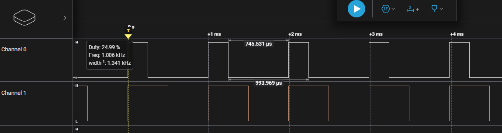

## 简介
这个demo是使用`Zephyr`的`API`实现的`pwm`信号输出，demo中共使用了两个`pin`,作为`pwm0`的`channel1`和`channel2`输出。

## 关键代码
* 在`prj.conf`中配置`pwm`
    ```c
    CONFIG_PWM=y
    ```
* 新建一个`.overlay`文件，加入`pwm`的`pin`配置
    ```c
    &pwm0_default {
    group2 {
        psels = <NRF_PSEL(PWM_OUT1, 0, 29)>, <NRF_PSEL(PWM_OUT2, 0, 28)>;
    };
    };

    &pwm0 {
    status = "okay";
    };
    ```
    我这里使用的是`nrf52840dk`，在`nrf52840dk`的原设备树上`pwm0`的`channel0`已经分配给了`P0.13`作为`LED`的控制，我们这里就不动他了，如果想看渐变效果的话，大家也可以试试`channel0`的效果。我这里是通过逻辑分析仪观察`channel1`和`channel2`的输出，所以重新分配了`channel1`和`channel2`的`pin`。

* 在`main.c`中加入必要的头文件
    ```c
    #include <zephyr/drivers/pwm.h>
    #include <zephyr/device.h>
    #include <zephyr/devicetree.h>
    ```
* 定义一个`pwm`设备
    ```c
    static const struct device *pwm_dev = DEVICE_DT_GET(DT_NODELABEL(pwm0));
    ```

* 判断`pwm`设备是否存在
    ```c
    if(!device_is_ready(pwm_dev)){
		printk("PWM device is not ready\n");
		return -1;
	}
	else{
		printk("PWM device is ready\n");
	}
    ```

* 配置`pwm`的频率和占空比
    ```c
    uint32_t freq = 1000;						   // Hz
	uint32_t pulse_width = 25;					   // percentage
	uint32_t period = 1000000000 / freq;		   // ns
	uint32_t pulse = (period * pulse_width) / 100; // ns

	ret = pwm_set(pwm_dev, 1, period, pulse, NULL);
	ret = pwm_set(pwm_dev, 2, period, pulse * 2, NULL);
    ```
    这里我设置了`pwm`的频率为`1000Hz`，两个通道`channel1`和`channel2`占空比分别为`25%`和`50%`。

* 编译并烧录程序，通过逻辑分析仪观察`channel1`和`channel2`的输出。

